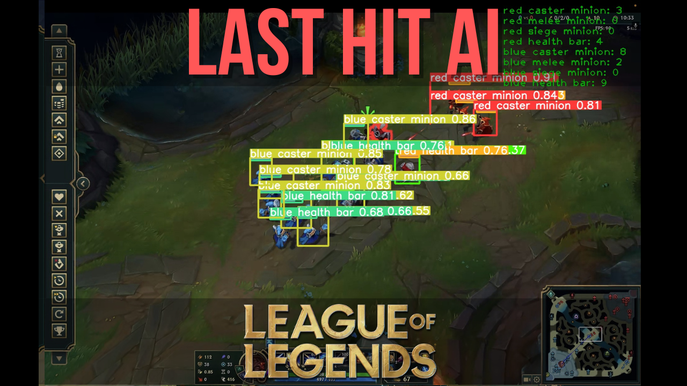

# League of Legends Last Hit Bot

This repository contains the code for a bot designed to automate the last-hitting process in League of Legends. The bot utilizes object detection techniques to identify and prioritize minions for last hits. The entire development process, from initial concept to final results, is documented in a [YouTube video](https://www.youtube.com/watch?v=tHWoz6xyk7k). 



## Features
- **Object Detection**: Uses [YOLOv9]([https://www.google.com/url?sa=t&source=web&rct=j&opi=89978449&url=https://github.com/WongKinYiu/yolov9&ved=2ahUKEwj9tLOFwoaIAxVwBNsEHRT7C3EQFnoECCAQAQ&usg=AOvVaw2dg0KGJMx_HkdUYJo6MPyS](https://github.com/WongKinYiu/yolov9)) for detecting minions.
- **Customizable Parameters**: Allows customization of target minion color, screen resolution, and other parameters.
- **Visualization**: Option to visualize the bot's decision-making process in real-time.

## Installation

1. Clone this repository:
   
```shell
git clone https://github.com/cengineer13/last-hit-bot.git
cd last-hit-bot
```

2. Install the required dependencies:
   
```shell
pip install -r requirements.txt
```

Note: The requirements.txt includes a dependency on the YOLOv9 repository. Ensure that you have it set up correctly.

3. Download the trained YOLOv9 weights from [this link](https://drive.google.com/file/d/135Bt-YX-Aqa_oaBxN220YSe9uGWiuljo/view?usp=share_link) and place them in the appropriate directory.


## Usage

Run the bot using main.py:
``` shell
python main.py
```

### Parameters
- **`monitor_idx`**: The index of the monitor to capture screenshots from (0 for primary monitor).
- **`visualize`**: Set to `True` to enable visualization, `False` to disable.
- **`minion_color`**: Specify the color of minions to target (e.g., `blue`, `red`).
- **`H`**: Half the height of the screen resolution.
- **`W`**: Half the width of the screen resolution.


Example:
   ```bash
   python main.py --monitor_idx 0 --visualize True --minion_color red --H 540 --W 960
   ```
## Contributing

If you'd like to contribute, feel free to fork the repository and submit a pull request. Contributions, bug reports, and feature requests are welcome!

## Acknowledgments

[YOLOv9](https://docs.ultralytics.com/models/yolov9/) for the object detection framework.
